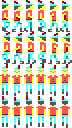

# agiview2bmp

*Command line tool to convert a Sierra Adventure Game Interpreter View resource to a bitmap image.*

agiview2bmp uses SDL3 to save the bitmap.

Example usage: `agiview2bmp VIEW.000 VIEW.014`

Each cel within a loop is laid out horizontally, and each loop in the View is placed in its own row, like so:

